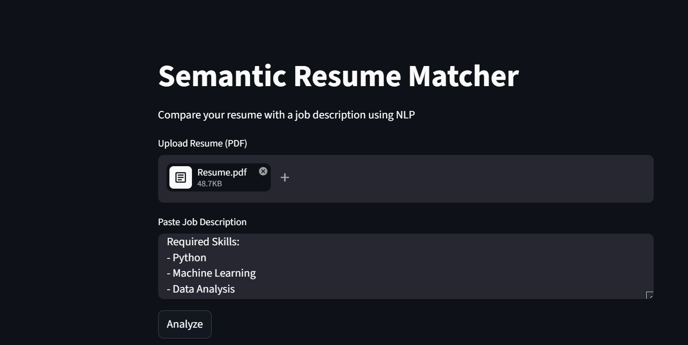
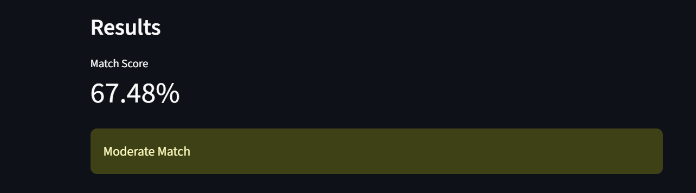
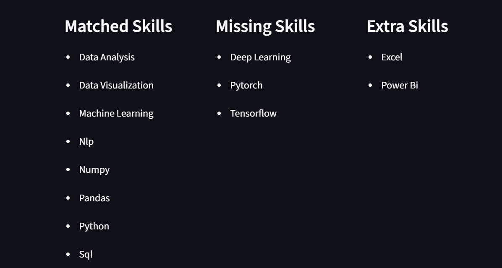
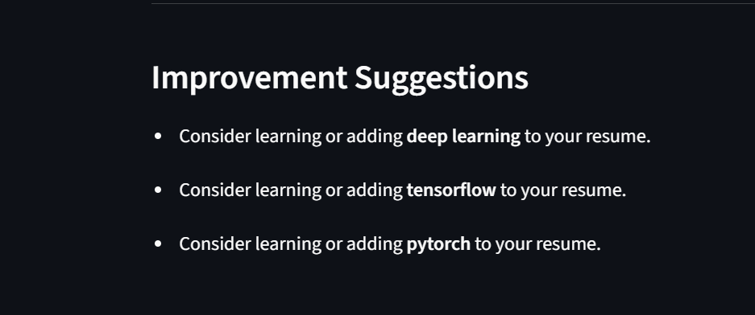

# Semantic Resume Matcher using NLP

**Live Demo:** https://semantic-resume-matcher-using-nlp-8fksnsakva3kiwv65tn8x9.streamlit.app/

---

## Overview

This project analyzes how well a resume matches a job description using Natural Language Processing (NLP).  
It combines **semantic similarity (Sentence-BERT)** with **spaCy-based skill extraction** to produce an interpretable match score, skill gap analysis, and actionable learning suggestions.

Unlike keyword-based matchers, this system understands semantic meaning — so "data wrangling" matches "data preprocessing" even without exact word overlap.

---

## Evaluation Results

Evaluated on 22 manually labeled resume-job pairs:

| Metric | Score |
|--------|-------|
| Accuracy | 95.45% |
| Precision | 1.00 |
| Recall | 0.92 |
| F1 Score | 0.96 |

**Threshold:** 0.4 — chosen based on score distribution analysis.  
Matching pairs cluster above 0.4 (mean: 0.699) while non-matching pairs fall below 0.4 (mean: 0.191), validating the threshold choice.


---

## Features

- Resume text extraction from PDF
- Semantic similarity scoring using Sentence-BERT (all-MiniLM-L6-v2)
- Skill extraction using spaCy PhraseMatcher (50+ DS/ML/tech skills)
- Skill gap analysis: matched, missing, and extra skills
- Specific learning suggestions for missing skills (with course links)
- Interactive Streamlit web interface
- Evaluation notebook with metrics, confusion matrix, and score distribution plot

---

## Tech Stack

| Component | Technology |
|-----------|-----------|
| Semantic Similarity | Sentence-BERT (all-MiniLM-L6-v2) |
| Skill Extraction | spaCy PhraseMatcher |
| PDF Parsing | PyMuPDF |
| Evaluation | Scikit-learn |
| Web Interface | Streamlit |
| Language | Python 3.13 |

---

## Methodology

1. Extract text from uploaded resume PDF
2. Generate sentence embeddings using Sentence-BERT
3. Compute cosine similarity between resume and job description embeddings
4. Extract skills from both texts using spaCy PhraseMatcher with alias handling
   - Example: "sklearn" and "scikit learn" both map to canonical "Scikit-learn"
5. Compare skill sets to identify matched, missing, and extra skills
6. Generate specific improvement suggestions with learning resources
7. Display results in an interactive Streamlit dashboard

**Why SBERT over TF-IDF:**  
TF-IDF relies on exact word overlap. SBERT captures semantic meaning — a resume mentioning "built classification pipelines" will match a JD asking for "machine learning model development" even without shared keywords.

---

## App Screenshots

### Input


### Match Score


### Skill Analysis


### Suggestions


---

## Project Structure
Semantic-Resume-Matcher-using-NLP/
├── main.py                  # Streamlit app
├── matcher.py               # SBERT similarity computation
├── parser.py                # PDF text extraction
├── skills.py                # spaCy skill extraction + gap analysis
├── requirements.txt
├── notebooks/
│   ├── evaluation.ipynb     # Evaluation with metrics + plots
│   ├── confusion_matrix.png
│   └── evaluation_plot.png
├── Input.png
├── score.png
├── skills.png
├── suggestions.png
└── README.md
---

## Run Locally

```bash
# Clone the repo
git clone https://github.com/shrav2610/Semantic-Resume-Matcher-using-NLP.git
cd Semantic-Resume-Matcher-using-NLP

# Install dependencies
pip install -r requirements.txt

# Download spaCy model
python -m spacy download en_core_web_sm

# Run the app
streamlit run main.py
```

---

## Key Technical Decisions

**Threshold = 0.4:** Determined empirically by analyzing score distributions. Positive pairs (true matches) produced a mean similarity of 0.699, while negative pairs averaged 0.191 — creating a clear separation window. A threshold of 0.4 captures this boundary with 95.45% accuracy.

**spaCy PhraseMatcher over simple keyword search:** Handles multi-word skills ("Random Forest", "Power BI") and aliases ("sklearn" → "Scikit-learn", "nlp" → "NLP") correctly, reducing false negatives in skill detection.

---

## Author

**Shravani**  
B.Tech ECE (AI & ML) — MIT World Peace University, Pune  
[GitHub](https://github.com/shrav2610)
